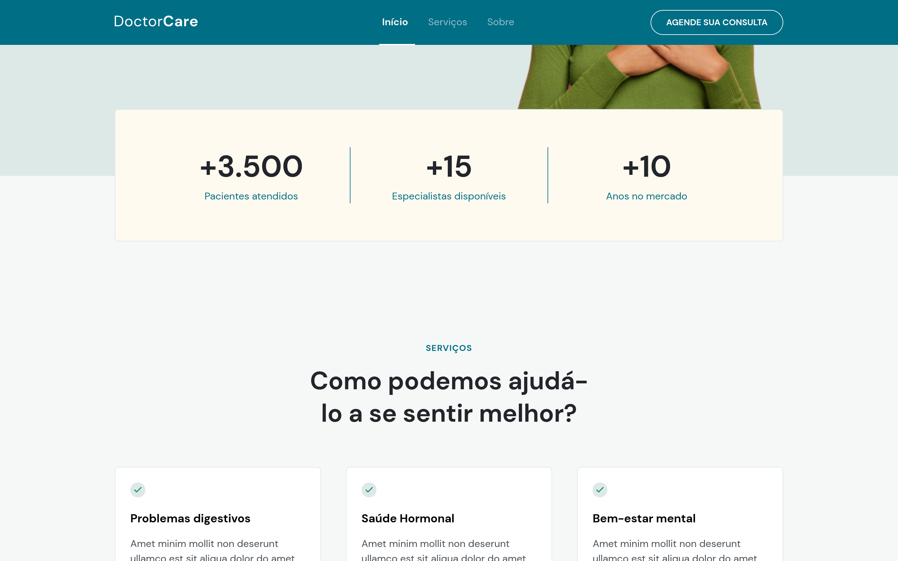

# doctorcare
Página responsiva criada durante o bootcamp intensivo de 5 disponibilizado pela Rocketseat.

Veja a Página [CLICANDO AQUI!](https://mayara-souza.github.io/doctorcare/).

## Construída com:
* HTML5 Semântico
* CSS3 Responsivo
* Javascript

### Tools:
* Git
* VS Code

### Interface Mobile

### Interface Desktop

